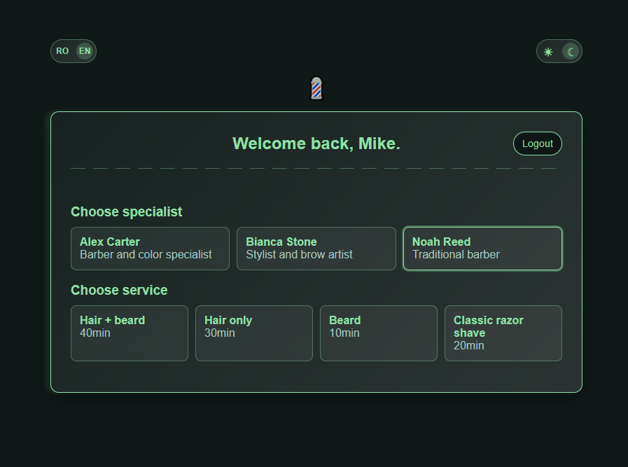

# Appointment Tool

[](https://www.php.net/releases/8.2/en.php)
[](#)
[](#)
[](#)
[](#)
[](#)

Appointment Tool is a single-file PHP booking application for a barber / hair stylist workflow.

It turns a small procedural PHP idea into a complete booking flow: specialist schedules, service durations, guest validation, break management, bilingual text, and a polished interface, all without a database or framework.

## Preview



## Description

The application lets a guest book a service with an available specialist, while specialists can manage bookings and block personal breaks during the day.

The entire app is contained in `index.php`, including data arrays, validation, session state, booking rules, translations, theme handling, and a responsive interface. The goal is not to hide complexity behind tools, but to make the logic visible and easy to follow.

## Features

- Guest and specialist login flows
- Romanian phone number validation with a fixed `+40` prefix
- Specialist services with different durations
- Automatic available time calculation
- Booking window from tomorrow up to one month ahead
- Specialist booking cancellation
- Specialist break management for `10min`, `20min`, `30min`, `1h`, or the full day
- Full-day breaks allowed only when no active bookings exist
- Past bookings and breaks are cleaned from the session
- Light and dark themes
- English and Romanian interface
- Minimal animated UI built directly in the page
- No database, no Composer setup, no framework

## Demo Accounts

Guests log in with only a name and phone number.

Specialists use the demo password:

```text
salon
```

The specialist data is stored directly in the PHP arrays so the project stays easy to read and modify.

## Running Locally

This project needs a PHP server. It does not run correctly on GitHub Pages because GitHub Pages does not execute PHP.

### Option 1: PHP built-in server

This is the simplest option on Windows, macOS, and Linux if PHP is already installed.

Clone the repository:

```bash
git clone git@github.com:alinmilitaru/appointment-tool.git
cd appointment-tool
```

Start the local PHP server:

```bash
php -S localhost:8000
```

Then open:

```text
http://localhost:8000/index.php
```

If the `php` command is not recognized, install PHP first or use a local package such as XAMPP, MAMP, Laragon, or another PHP stack.

### Option 2: XAMPP on Windows

Place the project inside:

```text
C:\xampp\htdocs\appointment-tool
```

Start Apache from the XAMPP Control Panel.

Then open:

```text
http://localhost/appointment-tool/index.php
```

### macOS note

macOS users can run the app with PHP's built-in server too. XAMPP also exists for macOS, but MAMP or Homebrew PHP are common alternatives.

## Why This Project Exists

Appointment Tool is a learning project with a very practical target: show how much can be achieved with plain PHP when the code is organized carefully.

It is not trying to compete with a full production booking platform. It is meant to show clean procedural logic, defensive input validation, state handling, and a UI that feels more complete than the size of the project suggests.

## Notes

- Bookings and breaks are stored in the PHP session.
- Refreshing the browser session or clearing cookies resets the demo data.
- This is a learning project, not a production booking system.
- The visible specialist password is intentional for demo purposes.

## Status

The project is feature-complete for its current purpose. Future improvements could include persistent storage, email notifications, and database-backed scheduling.

## Support

If this project helps you rethink what a small PHP app can become, a star or a thoughtful issue is appreciated.

## Rights

Usage rights are defined in the [LICENSE](LICENSE) file. In short, this repository is public for educational purposes only.

No permission is granted to publish, distribute, deploy, or use this code or derived work in commercial or production environments. All rights reserved.
